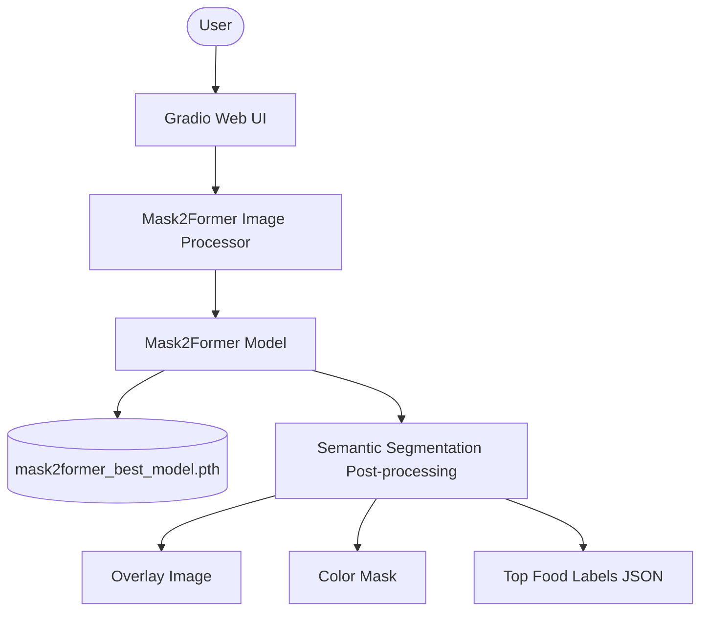
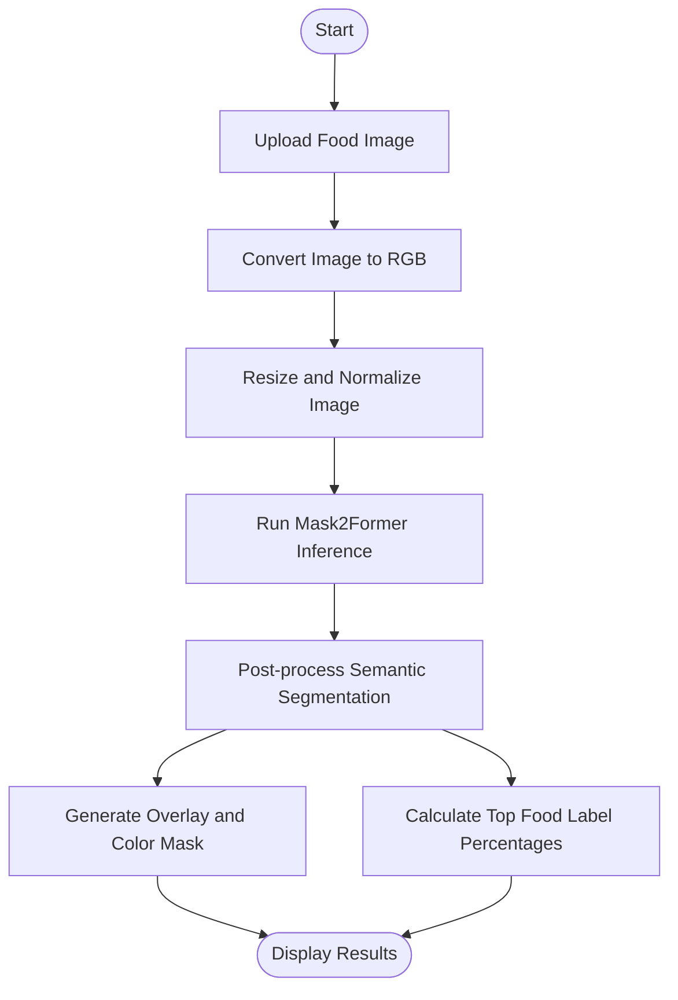

# Food Segmentation - Mask2Former

**An end-to-end semantic segmentation application for food images. The project uses a fine-tuned Mask2Former model to detect food ingredient regions, visualize segmentation masks, and summarize the most dominant food classes through a Gradio web interface.**

---

## Demo

The repository includes a recorded demo:

```text
FoodSeg Upload Demo - Google Chrome 2026-04-27 17-04-26.mp4
```

### Application Flow

1. Upload a food image through the Gradio interface.
2. The image is resized and preprocessed by `Mask2FormerImageProcessor`.
3. The fine-tuned Mask2Former checkpoint predicts a semantic segmentation map.
4. The app returns:
   - Overlay image: original image blended with the predicted mask.
   - Color mask: segmentation result using a deterministic color palette.
   - Top labels: most frequent predicted food classes with percentages.

---

## Architecture Overview

The project is organized as a lightweight inference application. Training and experimentation are kept in notebooks, while `app.py` provides the deployable demo interface.



### Inference Pipeline



---

## Core Features

### 1. Food Semantic Segmentation

The application performs pixel-level classification for food images. Each pixel is assigned to one of 104 classes, including background and FoodSeg-style food categories such as fruit, meat, seafood, vegetables, rice, noodles, pizza, bread, and other ingredients.

### 2. Fine-tuned Mask2Former

The inference app uses:

```python
MODEL_CKPT = "facebook/mask2former-swin-tiny-ade-semantic"
WEIGHT_PATH = "mask2former_best_model.pth"
NUM_CLASSES = 104
IMAGE_SIZE = 256
```

The base Mask2Former model is loaded from Hugging Face Transformers, then project-specific weights are loaded from `mask2former_best_model.pth`.

### 3. Visual Result Generation

For every uploaded image, the app creates two visual outputs:

- **Overlay**: combines the original image with the predicted segmentation colors.
- **Mask**: displays only the predicted class regions using a fixed color palette.

### 4. Top Label Summary

The predicted mask is analyzed with `Counter` to identify the most frequent non-background food classes. The result is returned as JSON with label names and pixel percentages.

### 5. Gradio Upload Demo

The user-facing interface is built with Gradio and supports direct image upload in the browser.

---

## Tech Stack

| Layer | Technologies | Role |
| :--- | :--- | :--- |
| Web Demo | Gradio | Browser-based upload and result visualization |
| Deep Learning | PyTorch, TorchVision | Model loading and tensor inference |
| Model Library | Hugging Face Transformers | Mask2Former model and image processor |
| Image Processing | Pillow, NumPy | Image conversion, mask coloring, overlay generation |
| Model Artifact | `.pth` checkpoint | Fine-tuned project weights |
| Experimentation | Jupyter Notebook | Training, evaluation, and demo experiments |

---

## Folder Structure

```text
CS431.Q21 - 23521403 - NguyenTaiTan - Project/
|-- app.py                                      # Gradio inference application
|-- requirements.txt                           # Python dependencies
|-- mask2former_best_model.pth                 # Fine-tuned Mask2Former checkpoint
|-- FoodSeg Upload Demo - Google Chrome ...mp4 # Recorded demo video
|-- Report_CS431.pdf                           # Project report
|-- Slides_CS431.pdf                           # Presentation slides
`-- Source code/
    |-- foodseg-hybrid-30min-modal (1).ipynb   # Training/experiment notebook
    |-- foodseg-upload-demo.ipynb              # Upload demo notebook
    |-- nd-mask2former.ipynb                   # Mask2Former experiment notebook
    `-- nd-modal (3).ipynb                     # Modal/cloud experiment notebook
```

---

## Getting Started

### Prerequisites

- Python 3.10 or newer is recommended.
- A machine with GPU is recommended for faster inference, but CPU can still run the demo.
- The checkpoint file `mask2former_best_model.pth` must be placed in the project root, next to `app.py`.

### Installation

1. Clone or open the project folder.

2. Create and activate a virtual environment:

   ```bash
   python -m venv .venv
   .venv\Scripts\activate
   ```

3. Install dependencies:

   ```bash
   pip install -r requirements.txt
   ```

### Run the Demo

Start the Gradio app:

```bash
python app.py
```

After the server starts, open the local Gradio URL shown in the terminal, usually:

```text
http://127.0.0.1:7860
```

---

## Usage

1. Open the Gradio URL in your browser.
2. Upload a food image.
3. View the predicted overlay and segmentation mask.
4. Check the JSON output to see the most dominant predicted food labels.

---

## Notes

- On the first run, Hugging Face Transformers may download the base model `facebook/mask2former-swin-tiny-ade-semantic`.
- If CUDA is available, the app automatically uses GPU. Otherwise, it falls back to CPU.
- The app loads the checkpoint with `strict=False` to tolerate small architecture/key differences between the base model and the fine-tuned checkpoint.
- The color palette is generated with a fixed random seed, so class colors remain consistent between runs.

---

## Project Documents

- `Report_CS431.pdf`: detailed project report.
- `Slides_CS431.pdf`: presentation slides.
- `Source code/`: notebooks used for training, experimentation, and demo development.
